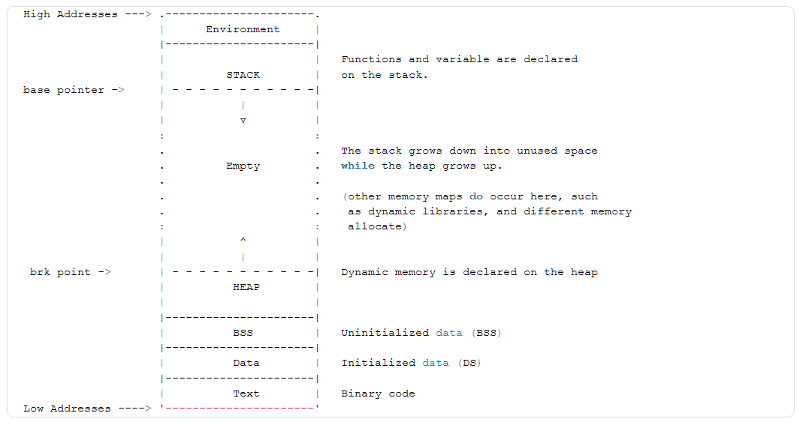

# C and C++ notes

## Compiler Stages:

1. Preprocessing Stage(main.c -> main.i)

- expansion of macros
- expansion of includes
- conditional compilation
- removal of comments

Errors like header file not found, incorrect preprocessor syntax(missing #endif for #if) or improperly defined macros are caught here itself.

2. Compiling Stage(main.i -> main.o)

- This stage involves syntax checking, type checking and semantics checking. It translated high-level C code into assembly-level code.

- Errors like syntax errors, type mismatch or misuse of variables, illegal operations are caught.

- Compiler find bugs or errors by comparing source code with the list of grammar rules specific to the programming language.

There are 4 stages in this as well where it does lexical analysis, syntax analysis, semantics analysis and then intermediate code generation.

3. Assembling Stage(main.s -> main.o)

In this stage, assembler takes in the assembly level code file and generates the machine code. This stage converts the human-readable assembly instructions into CPU-specific opcodes.At this stage function calls are not resolved.

4. Linking Stage(main.o -> .exe)

In this stage, all linking of function calls with their definition is done. Linker knows where all these functions are implemented. It also add extra code that is needed during start and end of the program. Linker also determines the memory layout of the program, assigning addresses to the global variables and funtions. Function calls and references are resolved, linking libraries and generating the executable.

Errors like multiple definition error, undefined references(if a function is declared but never defined, then the linker can't resolve the reference, basically calling a function that has not been implemented) or library issues are caught here.


## Execution of the Generated executable

When you double-click an executable like `main.exe`, a series of processes are initiated by the operating system (OS) to load and run the program. Here's a detailed explanation of what happens, along with the program layout, which is essential for understanding how the executable is executed.

### **1. Loading the Executable**
- **Step 1: User Action**: Double-clicking the `.exe` file sends a request to the OS to run the program.
- **Step 2: OS Process Creation**:
  - The OS (e.g., Windows) will create a **process** for `main.exe`. This involves allocating resources, creating a new process control block (PCB), and setting up the environment for the program to run.
  - The OS uses a **program loader** to read the executable file from the **hard drive** (HDD/SSD) into **memory (RAM)**.

**Interview Insight**:
- Explain that modern operating systems use a technique called **demand paging**, where only parts of the program are loaded into memory initially, and other parts are loaded as needed, helping in efficient memory utilization.

### **2. Program Memory Layout**
When `main.exe` is loaded into memory, it follows a specific **memory layout**. Here’s a breakdown of the sections:



#### **Memory Layout of a Running Program:**

| Segment       | Description |
|---------------|-------------|
| **Stack**     | Contains local variables, function call information (e.g., return addresses, parameters), and is managed in a Last-In-First-Out (LIFO) manner. It grows downward. |
| **Heap**      | Used for dynamic memory allocation (e.g., using `malloc` or `new`), grows upward, and managed by the programmer. |
| **Data Segment** - **Initialized Data** | Stores global and static variables that are initialized (e.g., `int x = 5;`).|
| **Data Segment** - **Uninitialized Data (BSS)** | Contains global and static variables that are not explicitly initialized (e.g., `int y;`).|
| **Text Segment** | Holds the actual compiled machine code instructions of the program. This segment is **read-only** to prevent accidental modifications. |
| **Command Line Arguments/Environment Variables** | The OS passes command-line arguments and environment variables to this section. |

**Interview Insight**:
- You can explain how **stack overflow** or **memory leaks** can occur due to improper usage of stack and heap, respectively.
- Understanding the role of each segment (e.g., **data, text, heap, stack**) and how they grow in relation to each other is important for embedded programming, where memory is a critical resource.

### **3. Memory Mapping**
- The OS uses a **memory management unit (MMU)** to handle **virtual memory**, mapping virtual addresses to physical addresses. This means that the program thinks it's accessing a continuous block of memory, but the OS maps these addresses to the actual physical memory locations.
- The OS sets up **page tables** for the process, ensuring each virtual address points to the correct physical memory.

**Key Points for Interviews**:
- Discuss how **address space isolation** prevents different processes from accessing each other’s memory, a critical security feature.
- Mention **shared libraries (DLLs in Windows)** and how they are also mapped into the process’s address space, avoiding redundancy.

### **4. Executing the Program**
- **Step 1: Program Counter (PC)**: The **program counter** is set to the entry point of the program (usually `main` function in C/C++).
- **Step 2: Stack Initialization**:
  - The OS sets up the **stack pointer** (SP) to point to the top of the stack. It also initializes the **base pointer** (BP) for stack frame management.
  - **Command-line arguments** and **environment variables** are pushed onto the stack before starting the program.
- **Step 3: Execution Begins**:
  - The CPU begins executing instructions sequentially, starting from the `main` function.
  - During execution, if the program needs to call a function, it will:
    - Push the **return address** and **arguments** onto the stack.
    - Jump to the function’s address in the **text segment**.
    - When the function completes, it will pop the **return address** from the stack and continue execution.

**Interview Insight**:
- Explain the **call stack** and how it manages function calls, and why **recursive functions** need careful handling (to prevent stack overflow).
- Demonstrate knowledge of **how interrupts** or **context switches** might affect program execution if the OS decides to pause your program and switch to another.

### **5. System Calls & Interaction with OS**
- Programs need to interact with hardware (e.g., read a file, send data over the network). They do this using **system calls**.
- **Example**: If `main.exe` needs to read a file, it will invoke a system call (e.g., `open`, `read`) which causes the CPU to switch from **user mode** to **kernel mode** to safely execute these operations.
- System calls are vital for program interaction with devices, memory management, file handling, etc.

**Key Terms**:
- **User Mode vs. Kernel Mode**: User mode limits the program’s ability to directly access hardware. Only kernel mode can safely perform these actions.
- **Process Scheduler**: Manages how the CPU time is shared between different running processes.

**Interview Insight**:
- Describe how **system calls** are crucial for **I/O operations**, **memory management**, and other interactions, showing your understanding of how user programs and the OS cooperate.

### **6. Termination**
- When `main.exe` finishes execution (i.e., the `main` function returns), the OS will:
  - Clean up resources (e.g., close open file descriptors, free allocated memory).
  - The process is removed from the list of active processes.
  - Any **exit status** is returned to the parent process (often the command line or shell).

### **Summary**
When asked to describe what happens when you run an executable:
1. **Process Creation**: The OS creates a process, assigns resources, and prepares to run the program.
2. **Memory Layout**: Understand the program layout (text, data, heap, stack) and how it's mapped into the process's address space.
3. **Execution & System Calls**: The CPU executes instructions starting from the entry point (`main`), using system calls for I/O and other interactions.
4. **Termination & Cleanup**: The OS handles cleanup and resource management once the program finishes.

### **Extra Tip for Interviews**
- If you can, mention **specific optimizations** like **copy-on-write** or **shared memory** that the OS may use to make the process more efficient.
- Discuss how knowing these details helps in **debugging**, **optimizing performance**, and understanding **low-level interactions** in embedded systems.

This level of detail should give you a solid foundation to answer this question impressively in an interview!


## Primitive data type:

All the data types in C and C++, we can categorize them into different groups: **fundamental (or primitive) data types**, **derived data types**, **user-defined data types**, and **additional types provided by C++**. Here's how you can explain them:

### 1. **Fundamental Data Types (Primitive Types)**
These are the basic types provided by the language:

- **C and C++**:
  - `char`: Represents a single character (typically 1 byte).
  - `int`: Represents an integer value (size varies based on system, e.g., 2 or 4 bytes).
  - `float`: Represents a floating-point number (typically 4 bytes).
  - `double`: Represents a double-precision floating-point number (typically 8 bytes).
  - `void`: Represents the absence of type (used for functions that don't return a value).
  - `bool` (C++ only): Represents a boolean value, `true` or `false` (added in C++).

- **Additional Variants**:
  - **Signed and Unsigned Types**:
    - `signed char`, `unsigned char`
    - `signed int`, `unsigned int`
    - `signed short`, `unsigned short`
    - `signed long`, `unsigned long`
    - `signed long long`, `unsigned long long` (C99 and C++11)

### 2. **Derived Data Types**
These are built from the fundamental types:

- **C and C++**:
  - **Pointers**: `int*`, `char*`, `float*`, etc.
  - **Arrays**: `int arr[10]`, `char name[20]`, etc.
  - **Functions**: Return types and parameter types are defined.
  - **References** (C++ only): `int&`, `char&`, etc.

### 3. **User-Defined Data Types**
These are created by the programmer:

- **C and C++**:
  - `struct`: Combines different types into a single entity.
  - `union`: Similar to `struct`, but all members share the same memory location.
  - `enum`: Enumeration types for defining named integer constants.

- **C++ Only**:
  - **Classes**: Similar to `struct`, but with the addition of member functions and more features (encapsulation, inheritance, polymorphism).
  - **`typedef` and `using`**: Used to define new names for existing types.
  - **`std::string`**: A class for handling sequences of characters more easily than C-style strings.

### 4. **Additional Data Types (C99 and C++ Standards)**
- **C99 Added Types**:
  - `long long int`: For larger integer types.
  - **Fixed-Width Integers**: `int8_t`, `int16_t`, `int32_t`, `int64_t`, and their unsigned versions from `<stdint.h>`.
  - `bool` (via `<stdbool.h>`)

- **C++ Adds Many More Types**:
  - **`std::string`**: A more powerful string handling class.
  - **Containers and Iterators** (STL): `std::vector`, `std::list`, `std::map`, etc.
  - **Smart Pointers**: `std::unique_ptr`, `std::shared_ptr`, etc.
  - **Wide Character Types**: `wchar_t`, `char16_t`, `char32_t`.
  - **Type Aliases**: `decltype`, `auto`, `std::nullptr_t`, etc. (C++11 onwards)

### Summary
1. **C**:
   - Fundamental types: `char`, `int`, `float`, `double`, `void`, etc.
   - Derived types: Pointers, arrays, functions.
   - User-defined types: `struct`, `union`, `enum`, `typedef`.
   - Additional (C99): `long long`, fixed-width integers.

2. **C++**:
   - All C types.
   - Extra fundamental type: `bool`.
   - More advanced user-defined types: Classes, `std::string`, smart pointers, etc.
   - Features from newer standards: `decltype`, `auto`, `nullptr`, smart pointers, wide characters, etc.

This breakdown should help you give a comprehensive answer if asked about the various data types in C and C++. You can also mention how the standards have evolved (e.g., C99, C++11, C++14, C++17, C++20) if the interviewer dives deeper.

---
**Additional learning**
I can print an integer in binary, octal and hex using printf command.
```cpp
int x =  11;
printf("0x%d", x); // for hex
printf("0o%d", x); // for octal
printf("%b", x); // for binary

// to specify the number I can always do this
x = 0x11; //for hex
x = 0o4; // for octal
x = 0b1100; // for binary
```

## Initializer List

### What Is an Initializer List?
An **initializer list** in C++ is a way to initialize the data members of a class before the constructor's body is executed. It is placed after the constructor signature and consists of a colon (`:`) followed by a list of member initializations, separated by commas. Each member is initialized with a value using the syntax: `member_name(value)`.

**Example**:
```cpp
class MyClass {
    int x;
    int y;
public:
    MyClass(int a, int b) : x(a), y(b) { // Initializer list
        // Constructor body
    }
};
```

### Why Do We Use Initializer Lists?
Using an initializer list has several benefits:
1. **Efficiency**: Data members are directly initialized, rather than being assigned values later. This can lead to performance improvements because the values are set in the memory when the object is created, instead of initializing them to default values first and then reassigning.
2. **Initialization of `const` Members**: You must use an initializer list to set `const` members, as they cannot be assigned after they are initialized.
3. **Initialization of References**: References must be initialized when they are created, so you need an initializer list for this.
4. **Initialization of Base Class**: If your class inherits from a base class, you need to use the initializer list to call the base class constructor.
5. **Calling Non-Default Constructors**: If a data member is an object of another class that does not have a default constructor, you have to use an initializer list.

### When to Use Initializer Lists vs. Constructor Body Initialization

1. **Use Initializer Lists When:**
   - **Initializing `const` Members**:
     ```cpp
     class MyClass {
         const int x;
     public:
         MyClass(int a) : x(a) {} // Must use initializer list for const members
     };
     ```
   - **Initializing References**:
     ```cpp
     class MyClass {
         int& ref;
     public:
         MyClass(int& r) : ref(r) {} // Must use initializer list for references
     };
     ```
   - **Calling Base Class Constructors**:
     ```cpp
     class Base {
     public:
         Base(int a) { /* ... */ }
     };

     class Derived : public Base {
     public:
         Derived(int a) : Base(a) {} // Must use initializer list to call base constructor
     };
     ```
   - **Initializing Members That Are Objects of Other Classes**:
     - If a class member is of a type that does not have a default constructor, or if you want to pass specific arguments to its constructor, you must use an initializer list.
     ```cpp
     class AnotherClass {
     public:
         AnotherClass(int a) { /* ... */ }
     };

     class MyClass {
         AnotherClass obj;
     public:
         MyClass(int a) : obj(a) {} // Must use initializer list to initialize `obj`
     };
     ```

2. **Initialize in the Constructor Body When:**
   - **The Member Variables Can Be Assigned After Initialization**:
     - For example, when you have basic types (like `int`, `char`, `float`), and there’s no significant difference between initializing and assigning.
     ```cpp
     class MyClass {
         int x;
     public:
         MyClass(int a) {
             x = a; // This is valid, but not always the best approach
         }
     };
     ```
   - **You Need to Perform Complex Initialization Logic**:
     - If the initialization involves more than just copying a value, and you need to run some conditional code, it might make sense to do it in the constructor body.
     ```cpp
     class MyClass {
         int x;
     public:
         MyClass(int a, int b) {
             if (a > b) {
                 x = a;
             } else {
                 x = b;
             }
         }
     };
     ```

### Cases Where You **Must** Use Initializer Lists
1. **`const` Data Members**: Once a `const` member is initialized, it cannot be changed. Therefore, you need to use an initializer list.
2. **Reference Members**: References need to be bound at initialization, so you must use an initializer list.
3. **Base Class Initialization**: If you want to pass specific values to a base class constructor, you have to use an initializer list.
4. **Member Objects Without Default Constructors**: If a class member does not have a default constructor, you must use the initializer list to call the appropriate constructor with parameters.

### Example Illustrating Good Use of Initializer List:
```cpp
class Complex {
    int real;
    int imaginary;
public:
    Complex(int r, int i) : real(r), imaginary(i) {} // Using initializer list is more efficient
};
```

### Summary
- **Initializer lists** are used for efficiency and to handle cases where direct initialization is necessary (e.g., `const` members, references, base classes, non-default-constructible objects).
- **Constructor body initialization** is more suitable when additional logic or conditional initialization is required.
- When preparing for interviews, make sure you can explain why and when each method should be used, and recognize situations that require initializer lists.


## Priority Inversion(OS)

This is a case where higher priority task is waiting for lower priority task to release the resources(semphores or mutex) that it needs. This defeats the purpose of priority-based scheduling where higher priority task is executed before lower priority task leading to unexpected behaviour, missing deadlines, system latency. Well it can occur in RTOS and multi-tasking environments where different tasks have different priorities.

## Volatile Qualifier

the volatile qualifier in C/C++ tell the compiler that the variable might change its value unexpectedly, even if the program doesn't explicitly modify. This prevent compiler from applying certain optimizations that assume the value will not change. Actually, it means that the value can be changed by interrupt or hardware. 

## Static Keyword

The `static` keyword in C++ has multiple uses depending on its context. Here's a breakdown:

---

### **1. General Use of `static`**
#### **a. Static Variables in a Function**
- A variable declared as `static` inside a function retains its value between function calls.
- It is initialized only once, and its value persists across function invocations.

```cpp
void example() {
    static int count = 0; // Initialized only once
    count++;
    std::cout << "Count: " << count << std::endl;
}

int main() {
    example(); // Count: 1
    example(); // Count: 2
    return 0;
}
```

#### **b. Static Variables at File Scope**
- A `static` variable or function at the global (file) scope is visible **only within the file** where it is declared.  
- This gives the variable or function **internal linkage**.

```cpp
static int count = 0; // Visible only in this file

static void display() {
    std::cout << "Count: " << count << std::endl;
}
```

---

### **2. Inside a Class**
In a class, the `static` keyword modifies variables and member functions.

#### **a. Static Data Members**
- Shared across all objects of the class.  
- There is **only one copy** of a static data member, no matter how many objects of the class are created.
- Must be defined outside the class.

```cpp
class Counter {
    static int count; // Declaration
public:
    Counter() { ++count; }
    static int getCount() { return count; }
};

// Definition and initialization of static member
int Counter::count = 0;

int main() {
    Counter c1, c2, c3;
    std::cout << "Total objects: " << Counter::getCount() << std::endl; // Output: 3
    return 0;
}
```

#### **Why Use Static Data Members?**
- To store information common to all objects, such as counting the number of objects.
- Acts like a global variable but with restricted access through the class.

---

#### **b. Static Member Functions**
- Can **only access static data members or other static member functions**.
- They do **not depend on any object**, so they can be called using the class name directly (no need to create an object).

```cpp
class Example {
    static int count;
public:
    static void setCount(int val) { count = val; }
    static int getCount() { return count; }
};

int Example::count = 0;

int main() {
    Example::setCount(10);
    std::cout << Example::getCount() << std::endl; // Output: 10
    return 0;
}
```

#### **Why Use Static Member Functions?**
- To operate on static data members.
- To perform utility tasks related to the class (e.g., factory methods, counters, etc.).

---

### **Key Differences Between Static Data and Member Functions**
| **Static Data Members**            | **Static Member Functions**          |
|------------------------------------|---------------------------------------|
| Shared among all instances.        | Can be called without an object.      |
| One instance in memory for the class. | Can access only static data members. |
| Declared with `static` in the class. | Declared with `static` in the class.  |

---

### **Usage Scenarios for `static`**
1. **Persistent State in Functions**:  
   Use `static` inside functions for variables that need to retain their value across multiple calls.

2. **Encapsulation in Modules**:  
   Use `static` at the file scope to prevent variables or functions from being accessed outside the file.

3. **Shared Resources in Classes**:  
   Use static data members to track or store information common to all objects.

4. **Utility Functions in Classes**:  
   Use static member functions for operations that don’t require object-specific data, like counters or configuration functions.

---

By mastering the `static` keyword, you can effectively manage memory, encapsulate data, and design efficient and reusable class-level utilities.

---

# C Language Interview Topics

## new operator vs malloc function

### **Differences Between `malloc` and `new`**

| Feature                           | `malloc`                               | `new`                                   |
|-----------------------------------|---------------------------------------|-----------------------------------------|
| **Language**                      | Function in C (also usable in C++).    | Operator in C++ (not available in C).   |
| **Memory Allocation**             | Allocates raw memory; does not call constructors. | Allocates memory and calls constructors for objects. |
| **Type Safety**                   | Returns `void*`, requiring explicit casting. | Returns a pointer of the specified type (type-safe). |
| **Initialization**                | Does not initialize the memory.        | Initializes memory if it’s an object or built-in type with default initialization. |
| **Deallocation**                  | Must be freed with `free()`.           | Must be deleted with `delete` (for single objects) or `delete[]` (for arrays). |
| **Exception Safety**              | Returns `NULL` on failure.             | Throws a `std::bad_alloc` exception on failure. |
| **Custom Allocation**             | Cannot be overloaded for custom behavior. | Can be overloaded for custom allocation logic. |
| **Overhead**                      | Lightweight; allocates memory only.    | Includes object construction overhead. |

---

### **How `malloc` Works**
`malloc` allocates a specified number of bytes in the heap memory and returns a pointer to the beginning of the block. Here's a simplified breakdown:

1. **Request to the Memory Manager:**
   - `malloc` requests memory from the operating system or the runtime's heap manager.
   - Internally, it uses system calls like `brk()` or `sbrk()` to manage heap memory.

2. **Search for Free Space:**
   - The heap manager maintains a free-list of memory blocks.
   - `malloc` searches this list for a block that satisfies the requested size.

3. **Allocation:**
   - If a suitable block is found:
     - It is removed from the free-list.
     - If the block is larger than requested, it might be split into smaller blocks, and the remaining portion is returned to the free-list.
   - If no block is found, the heap is expanded using system calls.

4. **Return Pointer:**
   - A pointer to the allocated memory is returned.
   - If the allocation fails (e.g., insufficient memory), `malloc` returns `NULL`.

#### Example:
```c
int *arr = (int *)malloc(5 * sizeof(int)); // Allocates space for 5 integers.
```

#### **Important Notes:**
- Memory allocated by `malloc` is **uninitialized**. The content of the memory is unpredictable.
- Always use `free()` to release memory.

---

### **How `new` Works**
`new` is an operator in C++ that allocates memory and calls the constructor if it’s used for objects. Here's how it works:

1. **Memory Allocation:**
   - Similar to `malloc`, `new` allocates memory from the heap.
   - It internally uses `malloc` or similar mechanisms to reserve the memory.

2. **Object Construction:**
   - After memory is allocated, `new` invokes the constructor of the object being created, ensuring proper initialization.

3. **Return Pointer:**
   - A pointer to the allocated and initialized object is returned.
   - If allocation fails, `new` throws a `std::bad_alloc` exception unless you use `nothrow` (`new (std::nothrow)`), in which case it returns `nullptr`.

#### Example:
```cpp
int *arr = new int[5]; // Allocates space for 5 integers and initializes them to 0 (default initialization).
```

#### **Important Notes:**
- Always release memory allocated by `new` using `delete` for single objects or `delete[]` for arrays.
- `new` is type-safe and does not require explicit casting.

---

### **Detailed Comparison of Allocation Process**

| Step                              | `malloc`                               | `new`                                   |
|-----------------------------------|---------------------------------------|-----------------------------------------|
| **1. Memory Request**             | Calls the heap manager directly.       | May use `malloc` internally.            |
| **2. Block Selection**            | Finds or expands a suitable memory block. | Similar process but includes type handling. |
| **3. Initialization**             | None; memory content is undefined.     | Invokes the constructor for objects.    |
| **4. Error Handling**             | Returns `NULL` on failure.             | Throws `std::bad_alloc` on failure.     |

---

### **Key Insights**
1. **Use `malloc` in C**:
   - Suitable for allocating raw memory in C.
   - Requires explicit casting in C++ and manual initialization.

2. **Use `new` in C++**:
   - Preferred for C++ because it integrates object construction, type safety, and exception handling.
   - Avoids the manual effort required for initialization and type conversion with `malloc`.

---

### **Example of Both in Practice**

#### Using `malloc`:
```c
#include <stdio.h>
#include <stdlib.h>

typedef struct {
    int x;
    int y;
} Point;

int main() {
    Point *p = (Point *)malloc(sizeof(Point)); // Allocate memory
    if (p == NULL) {
        printf("Memory allocation failed.\n");
        return 1;
    }
    p->x = 10; // Manually initialize
    p->y = 20;
    printf("Point: (%d, %d)\n", p->x, p->y);
    free(p); // Free memory
    return 0;
}
```

#### Using `new`:
```cpp
#include <iostream>
using namespace std;

class Point {
public:
    int x, y;
    Point() : x(0), y(0) {} // Default constructor
    Point(int a, int b) : x(a), y(b) {} // Parameterized constructor
    void display() { cout << "Point: (" << x << ", " << y << ")\n"; }
};

int main() {
    Point *p = new Point(10, 20); // Allocate memory and construct
    p->display();
    delete p; // Deallocate memory
    return 0;
}
```

---

By understanding the functionality and usage of both `malloc` and `new`, you can choose the appropriate tool for your application based on language and requirements.


